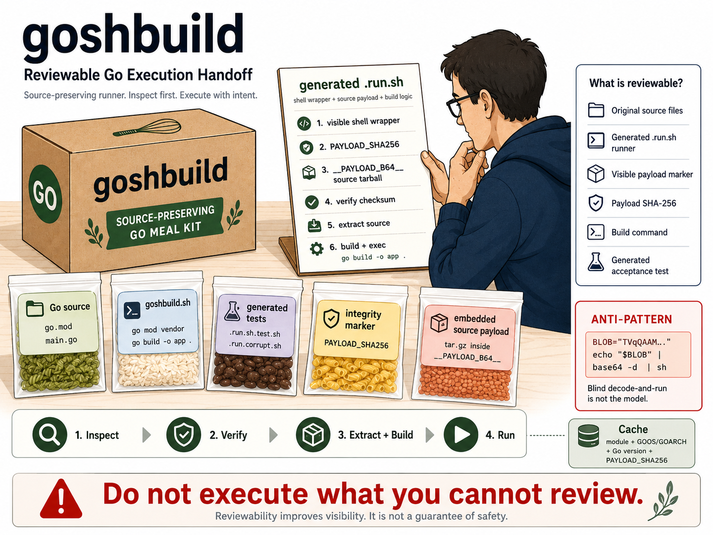

# goshbuild

Reviewable Go execution handoffs.

`goshbuild` makes Go build behavior visible, version-controlled, and reviewable before it runs locally or in CI.

> Do not execute what you cannot review.

`goshbuild` is a reference implementation of `GOSHB-001` from [`runplus-community/reviewable-workflows`](https://github.com/runplus-community/reviewable-workflows/blob/dev/specs/execution-handoffs/goshbuild.md).

## Why This Exists

Build and release helpers are often hidden in README instructions, CI config, local scripts, or binary-only handoffs.

`goshbuild` packages a Go module into a self-contained shell runner so the source and build behavior remain inspectable.

The bundle preserves the module source and build inputs, then emits a single
`sh` or `ps1` entry point that extracts, verifies, builds, and executes the
Go program at runtime.

It sits between two delivery models:

- binary-only distribution
- source-only repository delivery

`goshbuild` keeps the source tree intact and ships one runnable file per target
platform.

## How It Connects To Reviewable Workflow Handoffs

Reviewable Workflow Handoffs is the spec direction from [`runplus-community/reviewable-workflows`](https://github.com/runplus-community/reviewable-workflows).

`goshbuild` implements the Go execution handoff lane: it answers what source and build behavior are being handed to a developer shell or CI runner before execution.

## Visual Model



## Before / After

Before:

- build behavior can be scattered across README steps, CI config, local scripts, or binary-only handoffs
- reviewers may not have one clear artifact to inspect before execution

After:

- the source-preserving runner is the handoff artifact
- reviewers can inspect the runner, payload hash, build path, and generated test before running it
- first run verifies, extracts, builds, and executes; later runs can use the warm cache

Root-level entry points:

- `goshbuild.ps1` for PowerShell on Windows
- `test_goshbuild.sh` as the higher-order demo harness

## Install / Build

No package install is required for the current shell implementation.

Run the packer from this repo:

```bash
bash ./goshbuild.sh pack ./demo-app ./demo-app/demo-app.run.sh
```

On Windows, use the PowerShell wrapper:

```powershell
powershell -ExecutionPolicy Bypass -File .\goshbuild.ps1 pack .\demo-app .\demo-app\demo-app.run.sh
```

## Quick Start

```bash
bash ./test_goshbuild.sh
bash ./dist-demo-app/github_com_example_demo-app.run.sh --help
```

```powershell
bash ./test_goshbuild.sh
bash .\dist-demo-app\github_com_example_demo-app.run.sh --help
```

## Output

`pack` creates:

- `<name>.run.sh` - the self-contained runner
- `<name>.run.sh.test.sh` - acceptance tests for the runner

The generated runner embeds a tarball of the module source, verifies the
payload hash, extracts into a cache directory, builds the Go binary, and then
`exec`s the binary with the original arguments.

In the demo flow, the generated scripts land in `dist-demo-app/`,
and you can run the `.run.sh` and `.test.sh` files directly with `bash`.

## Packing Flow

```text
+-------------------------------+     +-------------------------------+     +-------------------------------+
| GO MODULE SOURCE              | --> | GOSHBUILD PACK                | --> | GENERATED RUNNER              |
| go.mod / *.go / assets        |     | vendor / tar / hash / b64     |     | <name>.run.sh / .ps1          |
| source stays in payload       |     | runner stub + checksum        |     | one runnable file             |
+-------------------------------+     +-------------------------------+     +---------------+---------------+
                                                                                        |
                                                                                        v
                                                           +----------------------------+----------------------------+
                                                           | COLD CACHE                 | WARM CACHE                 |
                                                           | first run in new env       | later runs in same env     |
                                                           | verify -> extract -> build | cache hit -> exec          |
                                                           | exec                       |                            |
                                                           +----------------------------+----------------------------+
```

## Behavior

- Any Go module can be delivered as a single `sh` or `ps1` entry point.
- The source tree remains multi-file and inspectable, while the handoff artifact stays single-file.
- The first run in a new environment performs a build; later runs reuse the cached binary when the cache key matches.
- Payload verification happens before extraction, which provides a corruption check before any source is unpacked.
- Cache keys include module identity, `GOOS/GOARCH`, Go version, and payload hash.
- Go compile time is low enough that first-run builds remain practical in CI.
- Unix-like environments use the bash demo harness; Windows uses `goshbuild.ps1`.

## Use Cases

### 1. CI/CD helper

A repository needs a build helper, release step, or test shim that must run on GitHub Actions Ubuntu and macOS without extra bootstrap work. `goshbuild` packages that helper into one runner file.

With a warm cache, the runner becomes a direct `exec` into the compiled Go binary.

### 2. Repeated internal automation

Teams often run the same internal utility repeatedly: code generation, repo-wide rewrites, validation passes, or maintenance commands. Because Go compiles quickly and the cache key includes the payload hash and toolchain details, repeat runs stay fast while still rebuilding when the source changes.

Go compile time stays low enough that first-run builds are practical and repeat runs are cache hits.

### 3. Support and incident-response bundle

An ops or support team can package a recovery tool, ship it as a single `.run.sh` or `.ps1`, and run it on a locked-down machine without installing Go or pulling dependencies from the network.

The checksum check provides an integrity gate before extraction.

### 4. Release handoff

The source project can remain split across many files, packages, and build steps, while the handoff artifact stays one runnable file.

The tradeoff is explicit: many files stay in the repository, one file is delivered to do the job.

## Demo app

`demo-app/` contains only the Go module. The higher-order bundle script is at [`test_goshbuild.sh`](test_goshbuild.sh) in the repo root and packs the demo app into `dist-demo-app/`.
The generated review folder has its own README with the structure breakdown.

```bash
bash ./test_goshbuild.sh
bash ./dist-demo-app/github_com_example_demo-app.run.sh --help
bash ./dist-demo-app/github_com_example_demo-app.run.sh.test.sh
```

```powershell
bash ./test_goshbuild.sh
bash .\dist-demo-app\github_com_example_demo-app.run.sh --help
bash .\dist-demo-app\github_com_example_demo-app.run.sh.test.sh
```

## Post-build Outputs

```text
dist-demo-app/
|-- github_com_example_demo-app.run.sh
|-- github_com_example_demo-app.run.sh.test.sh
`-- github_com_example_demo-app.run.corrupt.sh
```

You can run these scripts directly with `bash`.

For a deeper breakdown of the pack-time and runtime structure, see [dist-demo-app/README.md](dist-demo-app/README.md).

## Validation

Current workspace validation:

- `bash -n ./test_goshbuild.sh`
- PowerShell parse of `goshbuild.ps1`
- `bash ./test_goshbuild.sh`
- `bash ./dist-demo-app/github_com_example_demo-app.run.sh.test.sh`
- Windows pack/run validation passed through the `goshbuild.ps1` path
- GitHub Actions CI workflow added at [.github/workflows/ci.yml](.github/workflows/ci.yml)

The demo test suite passed `15/15` in this workspace.

## Usage

### Bash

```bash
bash ./test_goshbuild.sh
bash ./dist-demo-app/github_com_example_demo-app.run.sh --help
bash ./dist-demo-app/github_com_example_demo-app.run.sh.test.sh
```

### PowerShell

```powershell
bash ./test_goshbuild.sh
bash .\dist-demo-app\github_com_example_demo-app.run.sh --help
bash .\dist-demo-app\github_com_example_demo-app.run.sh.test.sh
```

## Requirements

- `go`
- `tar`
- `base64`
- `bash` for the generated runner

## Reviewability Model

Before trusting a `goshbuild` handoff, review:

- the source module being packed
- the generated `.run.sh` runner
- the payload checksum
- the embedded payload marker and generated test script
- the `go build` path inside the runner
- the cache key inputs: module identity, platform, Go version, and payload hash

The runner verifies the payload before extraction, builds with the local Go toolchain, caches the binary, and then `exec`s the result with the original arguments.

## Security Notes

`goshbuild` does not guarantee safe execution and does not replace dependency scanning, signing, SLSA, OpenSSF Scorecard, SBOMs, CI hardening, sandboxing, or code review.

It focuses on making the Go execution handoff visible and reviewable before it runs.

## Non-Goals

- replacing Go build tooling
- replacing CI security
- proving that embedded source is safe
- proving that generated runners are safe to execute without review
- replacing normal code review

## Release Notes

- [CHANGELOG.md](CHANGELOG.md)
- [RELEASE.md](RELEASE.md)

## Contributing

Contributions should improve clarity, inspectability, reproducibility, accurate docs, and tests. Avoid adding hidden execution behavior.

## License

MIT. See [LICENSE](LICENSE).
